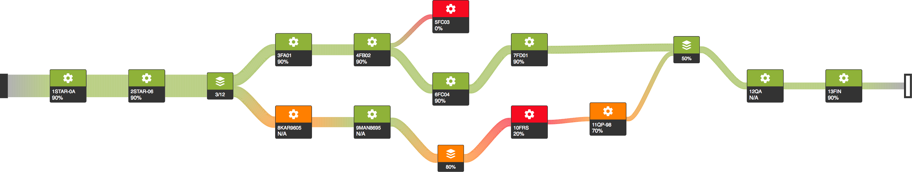
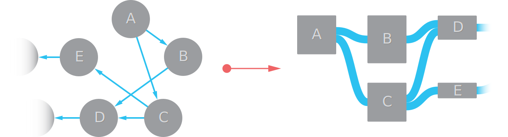
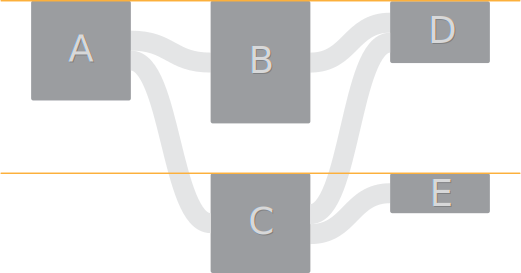
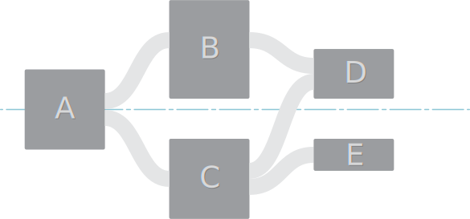
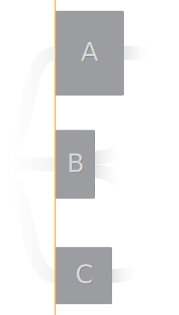
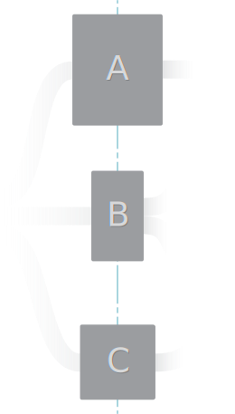
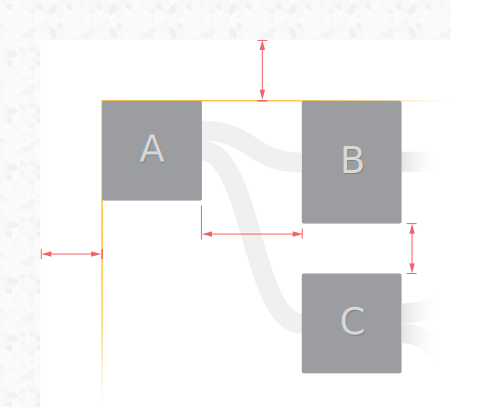
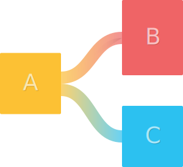

# sankey.js
JavaScript framework for creating Sankey diagrams with custom graphics.

## Supported diagrams
Diagrams that are supported can be characterized with following properties.

| Supported | Property | Elaboration |
| ------------- | ------------- | ------------- |
| ✅ Yes | Planar graphs  | "Planar drawings (or embeddings) make clear the structure of a given graph by eliminating crossing edges, which can be confused as additional vertices. Graphs defined by road networks, printed circuit board layouts, and the like are inherently planar because they are completely defined by surface structures." [1] |
| ✅ Yes | Directed graph  | Graph should be directed. |
| ✅ Yes | Acyclic graph  | Graph should be acyclic (e.g. no feedback loops, no material refinement loops). |
| ✅ Yes | More than one exit points (i.e. drains)?  | There can be any number of exit point since those nodes are handled just as any other node with exception to the source node.|
| ❌ No | More than one entry point (i.e. source)?  | There must be only one entry point. Layouting algorithm will use it as a starting point. |
| ❌ No | Orthogonal polyline drawings  | "Orthogonal means that all lines must be drawn either horizontal or vertical, with no intermediate slopes. Polyline means that each graph edge is represented by a chain of straight-line segments, connected by vertices or bends."[2].  Nodes can be connected only using relatively straight line that bends as it gets closer to the nodes (implemented using B-spline).  |

[1] _Skiena, Steven S. “15.12 Planarity Detection and Embedding.” [The Algorithm Design Manual](https://www.goodreads.com/book/show/425208), Springer, 2012, pp. 520–522._

[2] _Skiena, Steven S. “15.10 Drawing Graphs Nicely.” [The Algorithm Design Manual](https://www.goodreads.com/book/show/425208), Springer, 2012, pp. 513–516._

## Features
| | Description |
| --- | --- |
|  | Create model and let sanky.js do the layouting. |
|   | Distribute vertically to the top or center. |
|   | Align to other elements in the same column by left or center. |
|  | Adjust margines among elements and window. |
|  | Use custom SVG shapes for nodes. Shape can be picked based on type and property values (in our example it is efficiency level). |
|  | Links can either be monochromatic or use custom two colored gradients along the stroke. Opacity can also be adjusted. |

## Very general technical information

1. Has following dependancies
   * [d3.js](https://d3js.org/) 
   * [lodash](https://lodash.com/) 
   * [js-enumeration](https://github.com/miro-jelaska/js-enumeration)
2. Codebase is written in JavaScript ES6
3. Solution uses [webpack](https://webpack.js.org/)

# Usage and Implementation details
For usage and implementation details have a look at projects [📖 Wiki page](https://github.com/miro-jelaska/sankey.js/wiki).

Slides that I've used for presentation at Fraunhofer IWU on date 2017-09-21: [2017-09-21 sankey.js - Fraunhofer IWU.pptx](https://docs.google.com/presentation/d/1MFwjjpxJHyLAppi5qmNJw0DyzPS4EwNl/edit?usp=share_link&ouid=112950437582376179365&rtpof=true&sd=true).

# Support
Do you like it? Show it by giving a ⭐️. 🚀
